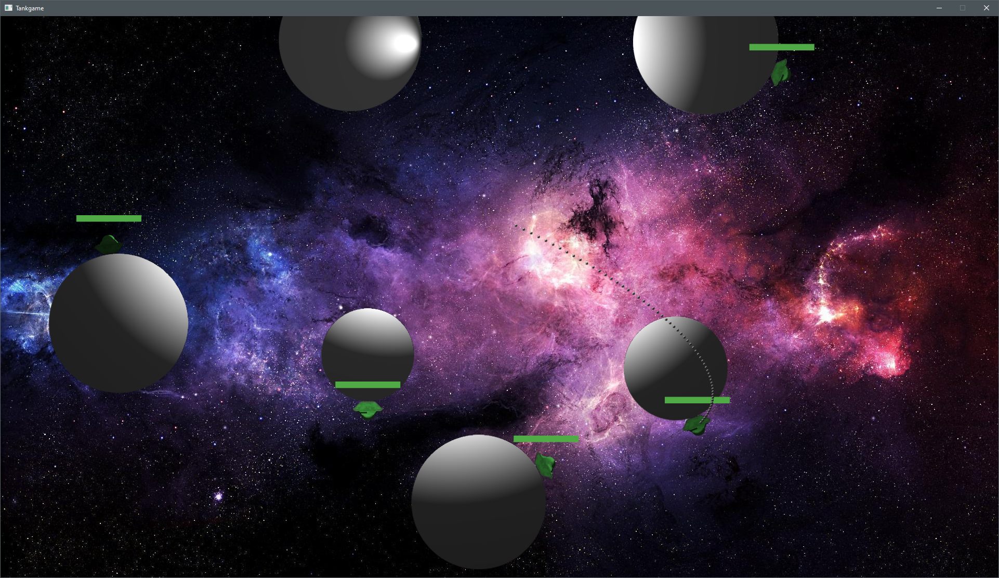
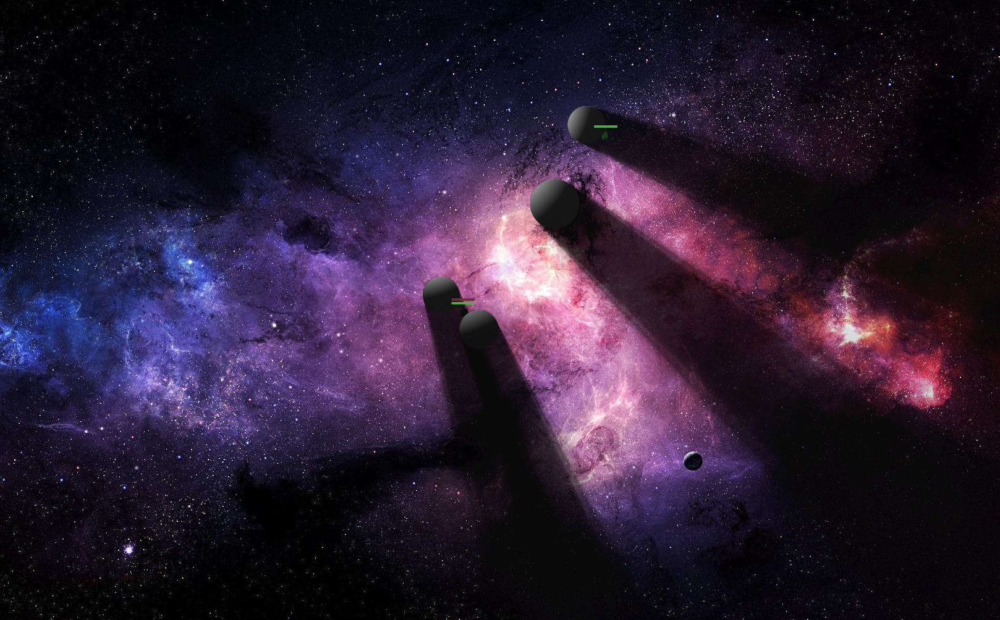
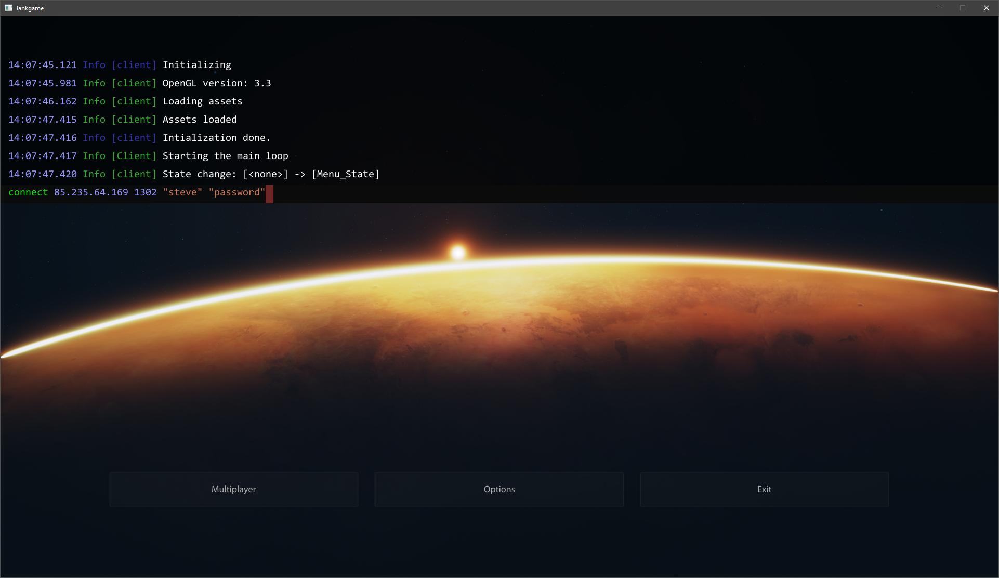

# Public Release of an WIP Project

This project is work-in-progress. Expect it not to compile or run properly.

This project uses OpenGL for rendering and SDL as the media framework. No engine was used, everything was hand-written, for fun and (no) profit.

> **NOTE:** This is a snapshot of an internal project that was put on ice some years ago.

## Screenshots:
Simulation of future game state for aim guides:

Shadow occlusion:

Quake-style developer console:

